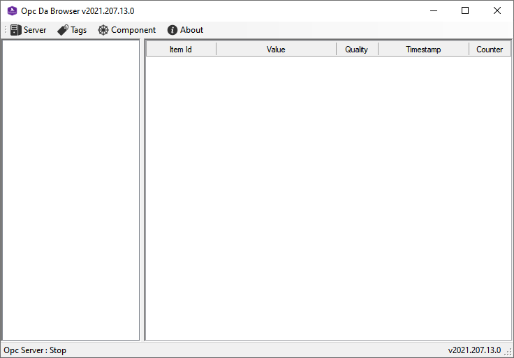
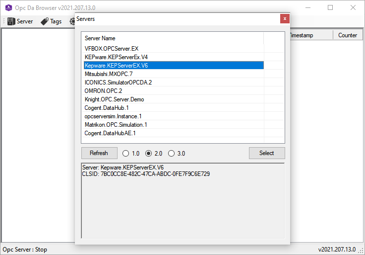
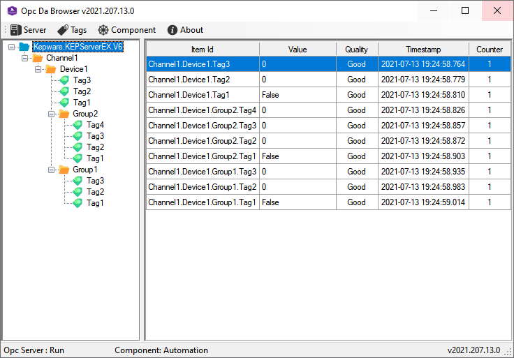
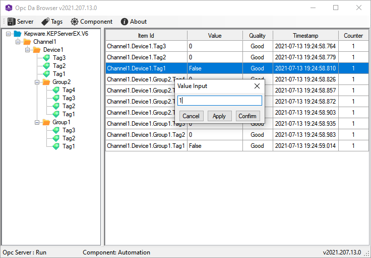

# OpcBrowser

Connect to opc server, browse opc tag, read and write tag value.

# OpcDaBrowser

OPC DA Specification

## References

- GodSharp.Opc.Da

  Sample Code: [github](https://github.com/godsharp/opcsample) | [gitee](https://gitee.com/godsharp/opcsample)

   

## Requirement
.NET Framework >= 4.0

## Screenshots

- main page
  

- server list
  

- tag list
  

- tag action
  

# LICENSE

[MIT LICENSE](./LICENSE)